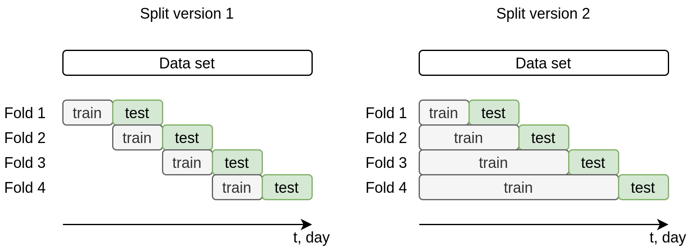
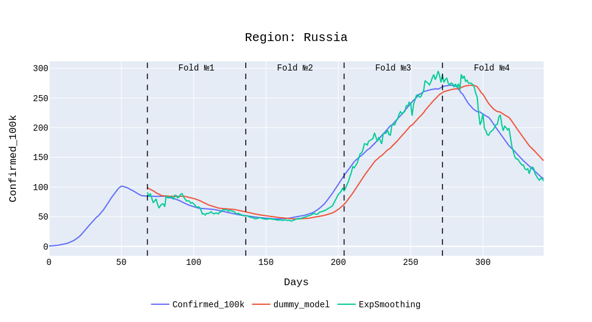

# COVID-19-baselines-Russia
This repository provides code and additional materials of the paper: "Baseline accuracies of forecasting COVID-19 cases in Russian regions on a year in retrospect using basic statistical and machinelearning methods".

Data
---

This work uses data from the [Yandex DataLens service](https://datalens.yandex.ru/marketplace/f2eb8io5l5q4rp84feo1) for a period of one year (from March 2020 to March 2021).

In order to bring all regions to a single scale, the data was normalized per 100 thousand population. The population size for each region was taken from Rosstat data on the demography of the regions of the Russian Federation.

Path to prepared data: "./data/df_prep_regions.json"
The file contains the following columns:
- 'Region' - name of the region of Russia;
- 'Date' - date in format: yyyy-mm-dd;
- 'Confirmed' - number of confirmed cases;
- 'Recovered' - number of recovered cases;
- 'Deaths' - number of deaths cases;
- 'Confirmed_100k' - scaled number of confirmed cases (Confirmed\*100000/n_region);
- 'Recovered_100k' - scaled number of recovered cases (Recovered\*100000/n_region);
- 'Deaths_100k' - scaled number of deaths cases (Deaths\*100000/n_region).

Baselines
---

You can get the calculated baseline results (presented below in the **Results** section) using the code provided in the Jupyter Notebook at ```"./notebooks/Computing_baseline_accuracy_of_forecasting.ipynb"```.

Here, in cell # 3, the necessary configuration parameters are selected:
1) Region ```configs['region_name']``` -- one from the list of available regions (located in appendix);
2) Prediction depth (how much in the future the forecast will take place) ```configs['prediction_depth']``` -- integer: in our experiments we took 1, 7, 14 or 28 days;
3) Type of the for formation of training and testing parts ```configs['forward_chaining']``` -- boolean (True or False), if the value is True, then the splitting is performed with the accumulation of training data; if False, then the splitting is performed with a sliding window. Both options are illustrated in Fig.1;
4) Model ```configs['model_name']``` -- name of one of the implemented basic models: "dummy_model", "AutoARIMA", "ExpSmoothing", "LinearSVR", "LR", "Ridge", "Lasso" or "RandomForest".


Figure 1. Types of splitting the full dataset into several folds of training parts. Left: splitting version 1, a sliding window; right: splitting version 2, accumulating training data.

After selecting the required configuration settings, you must run all the other cells in sequence. After the successful execution of the last cell, the MAPE metric values for each fold will be displayed, and the launch results will be saved in a file ```"./results/results.json"```. It contains configuration information as well as the original and predicted curve values for visualization.

To visualize the completed experiment, you can use the notebook ```"./notebooks/Visualization_of_results.ipynb"```. It requires _plotly_ library with a version not below 4.14.3. After its execution, an interactive graph in .html format will be saved in the folder ```"./results/"``` with a name like: ```{region_name}_Confirmed_100k_delta_{prediction_depth}_{model_name}.html```

Results
---

Detailed results for all regions are presented in the table "res_all_experiments.xlsx" in the folder ```./results/```.

Below is a tables with the results of the calculated baselines for averaged over all regions, as well as for Russia, as a separate region.

Table #1 shows the comparison of the forecasting models on different folds (train-test splitting performed with history accumulation) and with various forecasting horizons. For each fold and forecasting horizon, a model is characterized by its MAPE averaged over all regions.
Separately, Russia as a whole is considered in table #2. 

#### Table #1. MAPE (%), averaged over Russian regions, for different models, prediction horizons, and dataset parts (folds).

| Prediction range | Fold № | Dummy model | AutoARIMA | ES | GBR | LR | Lasso | LinearSVR | RF | Ridge |
| ---------------- | ------ | ----------- | --------- | -- | --- | -- | ----- | --------- | -- | ----- |
| 1 day            |    1   |      14     |     15    | 19 |  48 | 36 |   59  |     30    | 44 |   39  |
|                  |    2   |       9     |     10    | 15 |  20 | 11 |   51  |     11    | 20 |   18  |
|                  |    3   |       4     |      4    |  7 |  32 |  6 |   64  |      5    | 30 |   13  |
|                  |    4   |       6     |      7    |  9 |  17 |  8 |   58  |      7    | 18 |   17  |
| 7 day            |    1   |      21     |     23    | 25 |  66 | 73 |   62  |     50    | 65 |   74  |
|                  |    2   |      14     |     14    | 13 |  40 | 20 |   45  |     16    | 39 |   30  |
|                  |    3   |       9     |      7    |  7 |  41 | 12 |   55  |     12    | 40 |   24  |
|                  |    4   |      12     |     10    | 10 |  29 | 12 |   29  |     12    | 29 |   24  |
| 14 day           |    1   |      30     |     33    | 35 |  67 |123 |   90  |     97    | 67 |  105  |
|                  |    2   |      21     |     21    | 19 |  60 | 29 |   47  |     23    | 58 |   41  |
|                  |    3   |      18     |     12    | 11 |  46 | 23 |   49  |     20    | 46 |   37  |
|                  |    4   |      18     |     13    | 13 |  39 | 17 |   26  |     19    | 40 |   33  |
| 21 day           |    1   |      39     |     44    | 44 |  67 |173 |  122  |    173    | 67 |  130  |
|                  |    2   |      27     |     28    | 27 |  71 | 39 |   52  |     31    | 72 |   50  |
|                  |    3   |      26     |     16    | 15 |  49 | 33 |   51  |     26    | 50 |   47  |
|                  |    4   |      23     |     17    | 15 |  40 | 22 |   33  |     26    | 41 |   39  |
| 28 day           |    1   |      46     |     56    | 53 |  61 |184 |  130  |    262    | 61 |  140  |
|                  |    2   |      33     |     36    | 36 |  73 | 46 |   55  |     43    | 75 |   54  |
|                  |    3   |      34     |     21    | 20 |  51 | 43 |   53  |     31    | 52 |   53  |
|                  |    4   |      27     |     20    | 19 |  35 | 28 |   40  |     31    | 35 |   46  |

#### Table #2. The value of the MAPE error for different models for the Russia as a whole.

| Prediction range | Fold № | Dummy model | AutoARIMA | ES | GBR | LR | Lasso | LinearSVR | RF | Ridge |
| ---------------- | ------ | ----------- | --------- | -- | --- | -- | ----- | --------- | -- | ----- |
| 1 day            |    1   |       2     |      2    |  2 |  32 |  3 |   20  |      3    | 27 |   11  |
|                  |    2   |       2     |      2    |  2 |  11 |  2 |   28  |      2    |  9 |   10  |
|                  |    3   |       3     |      3    |  4 |  40 |  4 |   69  |      4    | 40 |   12  |
|                  |    4   |       3     |      3    |  3 |  18 |  3 |   40  |      3    | 19 |   13  |
| 7 day            |    1   |       5     |      4    |  4 |  38 | 39 |   11  |     25    | 39 |   25  |
|                  |    2   |      10     |      3    |  3 |  32 |  7 |   33  |      8    | 40 |   20  |
|                  |    3   |       8     |      3    |  3 |  57 |  7 |   68  |      6    | 57 |   28  |
|                  |    4   |      10     |      4    |  4 |  31 |  4 |   12  |      7    | 32 |   23  |
| 14 day           |    1   |      11     |      9    |  8 |  32 |127 |   26  |    182    | 33 |   36  |
|                  |    2   |      15     |      7    |  8 |  63 | 16 |   38  |      9    | 64 |   30  |
|                  |    3   |      19     |      5    |  5 |  56 | 23 |   65  |      7    | 55 |   48  |
|                  |    4   |      17     |      8    |  7 |  38 |  6 |   16  |     13    | 38 |   34  |
| 21 day           |    1   |      17     |     12    | 13 |  29 |117 |   31  |    315    | 30 |   34  |
|                  |    2   |      20     |     12    | 14 |  57 | 26 |   40  |     15    | 61 |   38  |
|                  |    3   |      29     |      7    |  7 |  61 | 38 |   64  |     23    | 61 |   59  |
|                  |    4   |      23     |     10    |  9 |  39 | 10 |   32  |      8    | 39 |   43  |
| 28 day           |    1   |      21     |     17    | 18 |  29 |103 |   36  |    588    | 29 |   29  |
|                  |    2   |      22     |     17    | 18 |  57 | 27 |   39  |     18    | 57 |   38  |
|                  |    3   |      40     |     12    | 12 |  62 | 49 |   64  |     33    | 62 |   62  |
|                  |    4   |      26     |     13    | 14 |  32 | 22 |   45  |     18    | 32 |   45  |

The true time series and the ones predicted by dummy model and exponential smoothing are shown in Figure #2.


Figure 2. True ("Confirmed_100k") and predicted ("Dummy_model" and "ExpSmoothing") series of the normalized 14-day total number of cases for Russia as a whole.

Future work
---
- comparison of the obtained results with population models such as SIR, SEIR, etc.;
- more advanced machine learning models, such as neural networks; 
- different approaches to enriching input data with additional features, such as weather data, self-isolation index,restrictive measures, features obtained from the analysis of social media such as Twitter (aspect-based sentimentanalysis, the number of mentions of the disease, etc.);
- the possibility to build a single model for all regions of Russia.

Requirements
---
- Python 3.6+
- json 2.0.9
- numpy 1.19.2
- pandas 1.1.4
- joblib 1.0.1
- sklearn 0.24.2
- statsmodels 0.11.1
- pmdarima 1.8.2
- plotly 4.14.3 (for visualization)

Appendix
---
List of available regions: 'Хакасия', 'Ивановская обл.', 'Севастополь', 'Рязанская обл.', 'Тверская обл.', 'Крым', 'Псковская обл.', 'Башкортостан', 'Ульяновская обл.', 'Бурятия', 'Московская обл.', 'Самарская обл.', 'Омская обл.', 'Иркутская обл.', 'Коми', 'Ленинградская обл.', 'Архангельская обл.', 'Калининградская обл.', 'Адыгея', 'Владимирская обл.', 'Чувашия', 'Саха (Якутия)', 'Брянская обл.', 'Калмыкия', 'Татарстан', 'Курганская обл.', 'Мурманская обл.', 'Карелия', 'Ростовская обл.', 'Челябинская обл.', 'Тыва', 'Пермский край', 'Хабаровский край', 'Оренбургская обл.', 'Камчатский край', 'Алтай', 'Новосибирская обл.', 'Карачаево-Черкессия', 'ХМАО – Югра', 'Кабардино-Балкария', 'Томская обл.', 'Кировская обл.', 'Ямало-Ненецкий АО', 'Мордовия', 'Санкт-Петербург', 'Волгоградская обл.', 'Еврейская АО', 'Тульская обл.', 'Курская обл.', 'Приморский край', 'Белгородская обл.', 'Красноярский край', 'Ингушетия', 'Забайкальский край', 'Чукотский АО', 'Тамбовская обл.', 'Ярославская обл.', 'Москва', 'Свердловская обл.', 'Липецкая обл.', 'Смоленская обл.', 'Калужская обл.', 'Марий Эл', 'Алтайский край', 'Ненецкий АО', 'Чечня', 'Ставропольский край', 'Нижегородская обл.', 'Костромская обл.', 'Тюменская обл.', 'Пензенская обл.', 'Орловская обл.', 'Краснодарский край', 'Магаданская обл.', 'Новгородская обл.', 'Саратовская обл.', 'Амурская обл.', 'Удмуртия', 'Кемеровская обл.', 'Вологодская обл.', 'Воронежская обл.', 'Северная Осетия', 'Дагестан', 'Астраханская обл.', 'Сахалинская обл.', 'Россия'.

Citing & Authors
---
If you have found our results helpful in your work, feel free to cite our publication and this repository as
```
@article{naumov2021baseline,
  title={Baseline accuracies of forecasting COVID-19 cases in Russian regions on a year in retrospect using basic statistical and machinelearning methods},
  author={Naumov, Aleksandr V and Moloshnikov, Ivan A and Serenko, Alexey V and Sboev, Alexander G and Rybka, Roman B},
  journal={Procedia Computer Science},
  year={2021}
  publisher={Elsevier}
}
```
Contributions
---
Thanks to [@naumov-al](https://github.com/naumov-al) for adding this additional materials.
